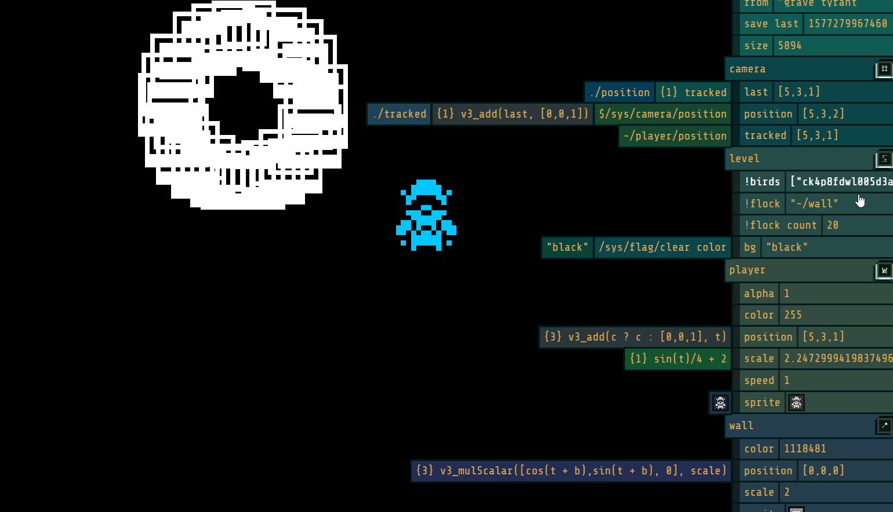
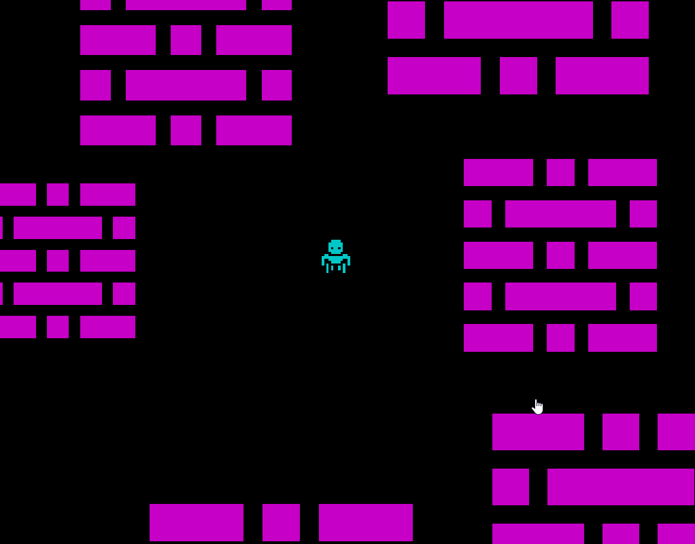

<a href="https://www.patreon.com/bePatron?u=20264446" data-patreon-widget-type="become-patron-button">Become a Patron!</a>
## [EarthRock.run](http://EarthRock.run)
	EarthRock.run is a playground to create and play games with your friends.

## [Goblin Games](http://github.com/agoblin/s/)
### [Grave Tyrant](http://earthrock.run/?agoblin/s/grave%20tyrant)
Raid ancient tombs from another planet in a top down bullet hell.

### Supply Chaos
Farm, barter, market and focus on the finer things in life.

### Over World
The landing game where you can find portals to other games floating around EarthRock.

## Features
 - Reactive Scripting (hit tilde! `)
 - Physics in Web Worker
 - Simple, Fast Shader built around 100ms ticks and curves
 - Browser Based (Firefox, ios Safari, Chrome targeted)
 - Quick Key Navigation for editing (Arrow keys / control / page up:down)

## Road Map
 - Gamepad
 - Audio
 - Networking
 - Local Multiplayer
 - Game process into own Web Worker
